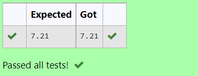

# DISTANCE-BETWEEN-TWO-POINTS

## AIM:
To write a python program to find the distance two 2 points
## ALGORITHM:
### Step 1: 
### Step 2: 
### Step 3: 
Substitute the values in the distance formula  

### Step 4: 
### Step 5: 
### PROGRAM:
import math 

a=[10,6]

b=[4,2]

d=(b[0]-a[0])**2+(b[1]-a[1])**2

e=math.sqrt(d)

print("{:.2f}".format(e))
  

### OUTPUT:

### RESULT:
